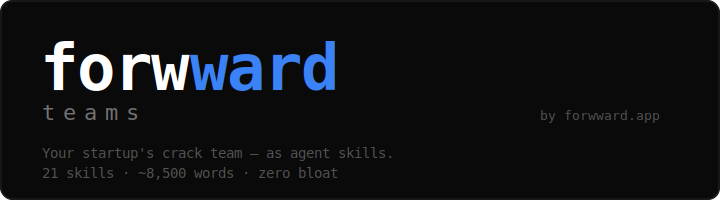

<p align="center">
  
</p>

<p align="center">
  Born from building <a href="https://forwward.app">forwward.app</a> in 7 days — built for founders who build.
</p>

## Why Lean Skills, Not 100

Most agents drown in skills. Every skill you add inflates context, burns tokens, and degrades output quality. We've seen agents with 50+ skills produce worse results than one with 5 — because the model spends half its context window just reading instructions it won't use.

**forwward-teams is a lean skills set for technical founders.** Everything you need, nothing you don't.

## What You Get

| Skill | Your Team Member | Does What |
|-------|-----------------|-----------|
| `/start` | Onboarding | Learns your company, initializes env, recommends first skills |
| `/onboard` | Setup Assistant | Configures new agents — 10 questions, tests tools, sets guardrails |
| `/team-lead` | Lead | Composes agent teams, coordinates parallel work |
| `/ceo` | CEO | Vision, OKRs, hiring, fundraising, pivot-or-persist |
| `/cto` | CTO | Architecture decisions, build-vs-buy, PRDs, tech debt |
| `/architect` | System Designer | DB selection, project structure, API design, caching, scaling |
| `/build` | Engineer | Fullstack — TypeScript + Python, design patterns |
| `/gate` | QA | Self-healing verification: lint → types → build → tests |
| `/strategy` | Strategist | Customer discovery, ICP, pricing, competitive intel |
| `/write` | Writer | Blog posts, X threads, newsletters — founder voice |
| `/gtm` | Growth | Viral loops, launch playbooks, K-factor optimization |
| `/pcp-engine` | Copywriter | Conversion copy, landing pages, email sequences — ICP-targeted |
| `/review` | Reviewer | Paranoid code review — races, N+1s, trust boundaries |
| `/ship` | Release Eng | Branch, verify, push, PR — release automation |
| `/design` | Designer | Anti-slop UI/UX — real design principles, no AI aesthetics |
| `/devops` | SRE | CI/CD, Docker, monitoring, alerting, incident response |
| `/data` | Analyst | SQL, metrics, dashboards, event tracking, cohort analysis |
| `/security` | InfoSec | OWASP, HIPAA, SOC 2, auth, encryption, compliance |
| `/finance` | CFO | Unit economics, burn rate, runway, financial models |
| `/sales` | AE | Outreach, demos, objection handling, pipeline management |
| `/legal` | Counsel | ToS, privacy, contracts, IP, licensing — industry-aware |
| `/medic` | Clinician | OCR medical records, clinical summaries, data presentation |
| `/switch` | Migration | Export all AI context, move to any platform |

## Install

### Works with Claude Code, Gemini CLI, Cursor, Codex, OpenCode

```bash
npx skills add iankiku/forwward-teams
```

Or install globally (all projects):

```bash
npx skills add iankiku/forwward-teams -g
```

### Interactive installer

```bash
npx @forwward/teams
```

### Claude Code plugin marketplace

```
/plugin marketplace add iankiku/forwward-teams
/plugin install forwward-teams@forwward
```

### Update

```bash
npx skills update
```

## Quick Start

```bash
# First time? Two options:
/start     # Learn your company, initialize environment
/onboard   # Configure a new agent from scratch (10 questions, tool testing)

# Then use your team
/team-lead Build user authentication with OAuth
/ceo       Should we raise a seed round or bootstrap?
/cto       Should we build or buy payments?
/build     Add Stripe checkout to the pricing page
/strategy  Define our ICP for enterprise sales
/write     Thread about what we learned shipping v2
/gtm       Design the referral loop for our waitlist
/gate
/review
/ship
```

## How It Works

```
npx skills add → copies SKILL.md files → your agent loads them on demand
```

- **Skills** are lean SKILL.md files (~80 lines each) that agents load on demand
- **No dependencies** — pure markdown, works in any repo
- **No lock-in** — delete any skill independently, they're self-contained
- **Cross-platform** — same format works across Claude, Gemini, Cursor, Codex, OpenCode

## Philosophy

- **Lean** — Every skill earns its place. No bloat, no context pollution.
- **Anti-bloat** — More skills = more context pollution = worse output. We chose quality over quantity.
- **Scaffold** — Basics that teams extend, not a rigid framework.
- **Plugin-friendly** — Install, uninstall, update cleanly.

## Contributing

1. Fork and clone
2. Add or edit skills in `skills/`
3. Keep SKILL.md under 100 lines — lean is the point
4. Test in a real project: `npx skills add ./path/to/fork`
5. Open a PR

## License

MIT

---

**Note:** This skill set is provided as-is for educational and personal use. The access and permissions you grant your agent are your responsibility to configure and enforce. The author is not liable for data loss, unintended access, or misconfiguration resulting from use of these skills.

---

Built by [@iankiku](https://github.com/iankiku) — born from building [forwward.app](https://forwward.app) in 7 days
