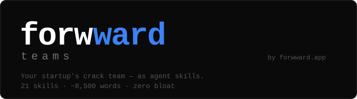

<p align="center">
  
</p>

<p align="center">
  Born from building <a href="https://forwward.app">forwward.app</a> in 7 days — built for founders who build.
</p>

## Why Lean Skills, Not 100

Most agents drown in skills. Every skill you add inflates context, burns tokens, and degrades output quality. We've seen agents with 50+ skills produce worse results than one with 5 — because the model spends half its context window just reading instructions it won't use.

**forwward-teams is a lean skills set for founders and their teams.** Everything you need, nothing you don't. Built for technical teams but includes skills for ops, hiring, meetings, presentations, and writing — the whole team, not just engineering.

## What You Get

### For the whole team

| Skill | Your Team Member | Does What |
|-------|-----------------|-----------|
| `/start` | Onboarding | Learns your company, initializes env, recommends first skills |
| `/onboard` | Setup Assistant | Configures new agents — 10 questions, tests tools, sets guardrails |
| `/standup` | Chief of Staff | Status updates that leaders actually read — outcome-first, with options + lean for blockers |
| `/meeting` | Meeting Scribe | Turns transcripts or rough notes into decisions, action items (owner + deadline), and open questions |
| `/write` | Writer | Blog posts, X threads, newsletters — founder voice |
| `/voice` | Voice Coach | Captures your writing style so `/write`, `/gtm`, `/pcp-engine`, `/sales` sound like you |
| `/deck` | Presentation Strategist | Slide structure and content for pitches, QBRs, board updates — the argument, not the design |
| `/hire` | Talent Partner | Job descriptions, interview rubrics, scorecards, and offer letter templates for any role |
| `/ops` | Ops Writer | SOPs, process docs, runbooks, and handoff docs for non-technical and cross-functional teams |
| `/team-memory` | Memory Consolidator | REM sleep for the team — reads what shipped, writes shared memory of decisions, fixes, and learnings |

### Engineering

| Skill | Your Team Member | Does What |
|-------|-----------------|-----------|
| `/team-lead` | Lead | Composes agent teams, coordinates parallel work |
| `/cto` | CTO | Architecture decisions, build-vs-buy, PRDs, tech debt |
| `/architect` | System Designer | DB selection, project structure, API design, caching, scaling — detects your stack |
| `/build` | Engineer | Fullstack across any stack — detects TypeScript, Python, Go, Rails, Java, Rust and adapts |
| `/gate` | QA | Self-healing verification: lint → types → build → tests — works with any build system |
| `/audit` | Senior Engineer | Removes slop, dead code, DRY violations, and SOLID violations — one commit, no behavior changes |
| `/review` | Reviewer | Paranoid code review — races, N+1s, trust boundaries, OWASP |
| `/ship` | Release Eng | Branch, verify, push, PR — release automation |
| `/design` | Designer | Anti-slop UI/UX — real design principles, no AI aesthetics |
| `/devops` | SRE | CI/CD, Docker (Node/Python/Go/Rails), monitoring, alerting, incident response |
| `/security` | InfoSec | OWASP, HIPAA, SOC 2, auth, encryption — stack-neutral |
| `/data` | Analyst | SQL, metrics, dashboards, event tracking, cohort analysis |
| `/technical-writer` | Tech Writer | Docs, runbooks, API references, READMEs — structured discovery before drafting |

### Business

| Skill | Your Team Member | Does What |
|-------|-----------------|-----------|
| `/ceo` | CEO | Vision, OKRs, hiring, fundraising, pivot-or-persist |
| `/strategy` | Strategist | Customer discovery, ICP, pricing, competitive intel |
| `/gtm` | Growth | Viral loops, launch playbooks, K-factor optimization |
| `/pcp-engine` | Copywriter | Conversion copy, landing pages, email sequences — ICP-targeted |
| `/finance` | CFO | Unit economics, burn rate, runway, financial models |
| `/sales` | AE | Outreach, demos, objection handling, pipeline management |
| `/legal` | Counsel | ToS, privacy, contracts, IP, licensing — industry-aware |
| `/medic` | Clinician | OCR medical records, clinical summaries, data presentation |
| `/switch` | Migration | Export all AI context, move to any platform |

## Install

### Works with Claude Code, Gemini CLI, Cursor, Codex, OpenCode

```bash
npx skills add iankiku/forwward-teams
```

Or install globally (all projects):

```bash
npx skills add iankiku/forwward-teams -g
```

### Interactive installer

```bash
npx @iankiku/forwward-teams
```

### Claude Code plugin marketplace

```
/plugin marketplace add iankiku/forwward-teams
/plugin install forwward-teams@forwward
```

### Update

```bash
npx skills update
```

## Quick Start

```bash
# First time? Two options:
/start     # Learn your company, initialize environment
/onboard   # Configure a new agent from scratch (10 questions, tool testing)

# Then use your team
/team-lead Build user authentication with OAuth
/ceo       Should we raise a seed round or bootstrap?
/cto       Should we build or buy payments?
/build     Add Stripe checkout to the pricing page
/strategy  Define our ICP for enterprise sales
/write     Thread about what we learned shipping v2
/gtm       Design the referral loop for our waitlist
/meeting   Paste your call transcript — get decisions + action items
/standup   Write my update for the leadership team
/hire      Write a JD for a senior backend engineer
/gate
/review
/ship
```

## How It Works

```
npx skills add → copies SKILL.md files → your agent loads them on demand
```

- **Skills** are lean SKILL.md files (~80 lines each) that agents load on demand
- **No dependencies** — pure markdown, works in any repo
- **No lock-in** — delete any skill independently, they're self-contained
- **Cross-platform** — same format works across Claude, Gemini, Cursor, Codex, OpenCode
- **Stack-agnostic** — technical skills detect your project's stack and adapt (TypeScript, Python, Go, Rails, Java, Rust, and more)

## Philosophy

- **Lean** — Every skill earns its place. No bloat, no context pollution.
- **Anti-bloat** — More skills = more context pollution = worse output. We chose quality over quantity.
- **Scaffold** — Basics that teams extend, not a rigid framework.
- **Plugin-friendly** — Install, uninstall, update cleanly.

## Contributing

1. Fork and clone
2. Add or edit skills in `skills/`
3. Keep SKILL.md under 100 lines — lean is the point
4. Test in a real project: `npx skills add ./path/to/fork`
5. Open a PR

## License

MIT

---

**Note:** This skill set is provided as-is for educational and personal use. The access and permissions you grant your agent are your responsibility to configure and enforce. The author is not liable for data loss, unintended access, or misconfiguration resulting from use of these skills.

---

Built by [@iankiku](https://github.com/iankiku) — born from building [forwward.app](https://forwward.app) in 7 days
